# Thorin and company

## This project was built using GitPod and Git.

## Deployment on Heroku

### Create the Heroku app

1. Create an account or Login:
    * [Sing up](https://signup.heroku.com/login)
    * [Login](https://id.heroku.com/login)

2. Click on Create a new app:
    * 

3. Fill up the form:
    * Make sure to give a unique name to your app.
    * Spaces are not allowed and hyphens should be used instead.
    * Set your region.
    * Click on Create app.
    * 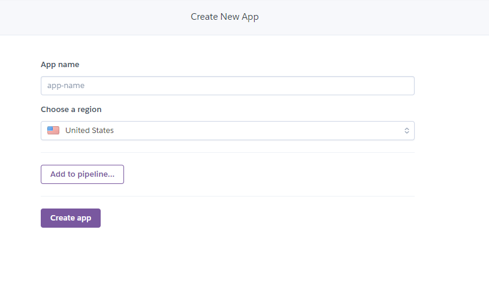

4. You are now directed to your app dashboard.

5. Scroll down to *Install the Heroku CLI*:
    * There are different option available to deploy the project. Here we are using Heroku command-line-interface (CLI) also known as **Heroku toolbelt**.
    * 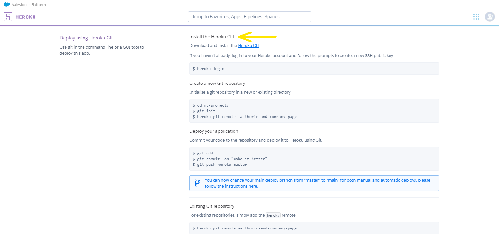

6. Go to your Integrated Development Environment (IDE) and open your project.

7. Open the **terminal** and follow the next steps.

8. Install Heroku by typing:
    * `` npm install -g heroku`` in the CLI.
    * **npm** stand for Node Package Manager.
    * **-g** means that we install the Heroku **globally** or system-wide.
    * It is important to note that if **-g** is not included, Heroku will only be installed within a directory called “node-modules” and it will not work as we want it to.

9. Login to Heroku in the terminal:
    * Type ``heroku login -i``.
    * Follow the steps by entering the account details used for this project on Heroku.
    * 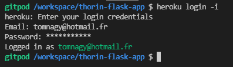

10. On the Heroku platform and on your app dashboard, look for **Open app** on the top right by scrolling up:
    * 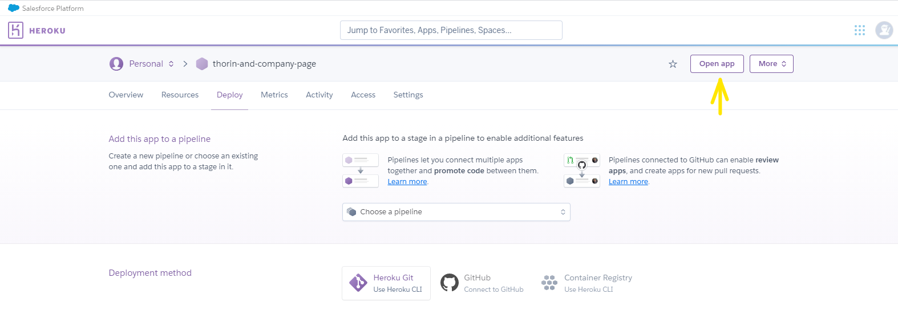

11. Now your Heroku app is running:
    * Note that this is the default Heroku app and that you still need to **push** your project to it.
    * Your app's URL corresponds to https://**your-app-name**.herokuapp.com

### Deploy to Heroku

1. By pushing your code to the Git URL that Heroku provides:
    1. Go to settings on your Heroku dashboard and copy your Heroku Git URL.
    2. 
    3. 
    4. Create another git remote (that will be different from “origin”*):
        * Type in the terminal ``git remote add *name-of-your-remote*`` + paste the Git URL and press enter.
        * 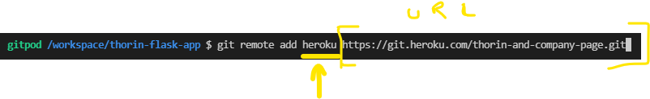
    5. Push to Heroku:
        * Type in the terminal ``git push -u *name-of-your-remote* master``
        * 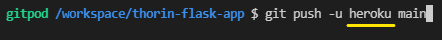
    6. You will get an error message because the requirements file is missing. We will add it in the next step.
    7. We need to create a requirements.txt file that will list all the Python dependencies the project needs to install in order to run successfully:
        * This will provide Heroku a mean to know what language we are using.
        * Type in the terminal ``pip3 freeze --local > requirements.txt``. This will redirect the output of the freeze command (that list the dependencies) into a file called **requirements.txt**.
        * **Add**, **Commit** and **Push** to Heroku remote master as in step **5.**:
        * 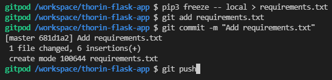
    8. Create a Procfile:
        * Type in the terminal ``echo web: python run.py > Procfile``.
        * It is important to note that *run.py* is the name of our python file and *Procfile* is with a capital **P**.
    9. **Add**, **Commit** and **Push** as shown below:
        * 
    10. By reloading a refreshing your app on Heroku or by clicking on ``Òpen app``, your app should display now.
    11. Because in this project we use a secret-key variable, we need, for the application to fully function, to add any hidden environment variables, or Config Vars, within our App Settings.
        * Go to the app settings.
        * Click on ``Reveal Config Vars``.
        * 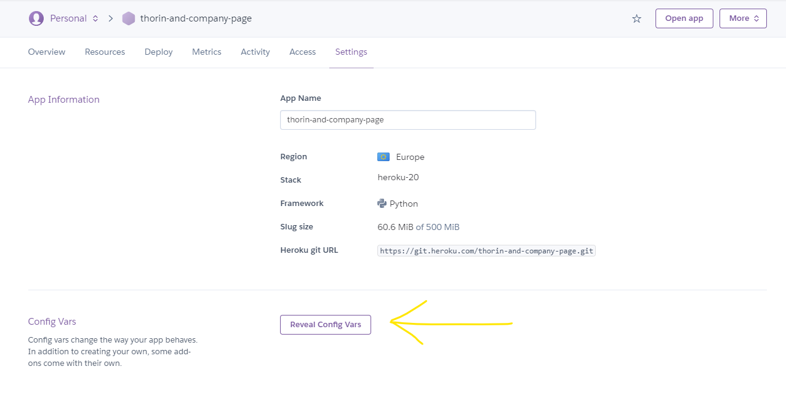
        * Add the variables as shown:
        * 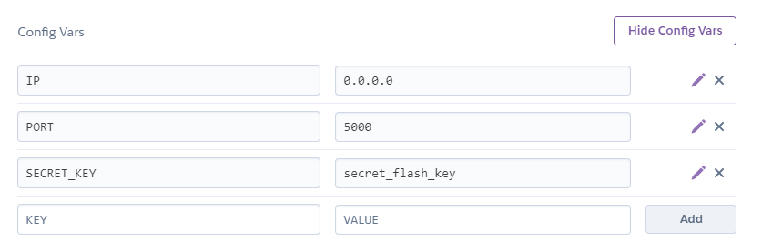
        * The first two correspond on how we set the app and can be found on top of the run.py file.
        * The last ones come from the env.py file.

2. By linking a GitHub repository to Heroku and deploy it automatically from GitHub.
    1. From the Deploy section of your app, click on the GitHub Deployment method:
    2. 
    3. Click on connect to GitHub and Authorize Heroku to connect.
        * 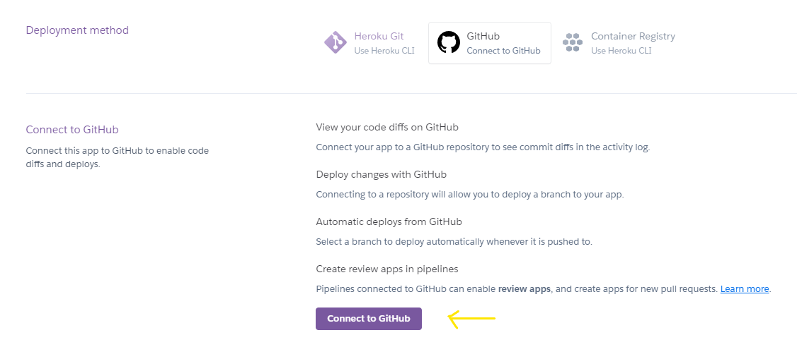
        * 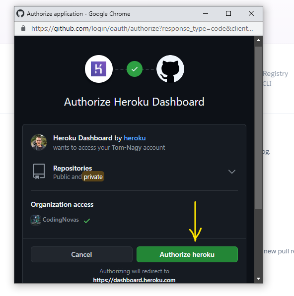
    4. Fill up the input for the name of your repository and click search.
    5. Click connect.
        * 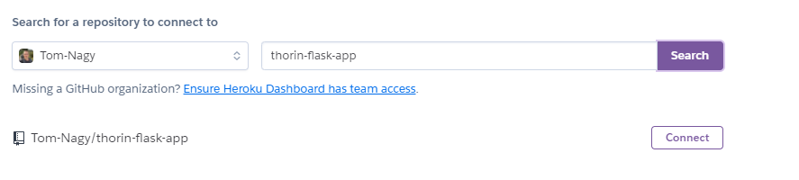
    6. Click on ``Deploy Automatically`` and ``Deploy Branch``.
        * 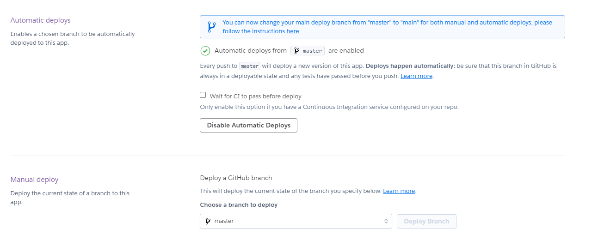
    7. You need to make sure your project is not connected to Heroku but only to GitHub:
        * in the terminal, type `git remote -v` and if it returns more the *heroku* remote, than remove it with the command ``git remote rm *name-of-your-remote*``
    8. **Add** and **Push** your project to GitHub:
        *
    9. When Deployment successful, you can view the website clicking on ``view`` or ``Òpen app``
        * 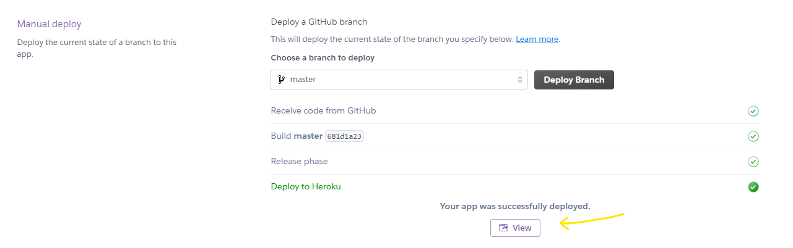

1. Create a Heroku app
2. Connect Git remote to Heroku
3. Create a requirements.txt file
4. Create a Heroku Procfile: Tells heroku how to run the project
